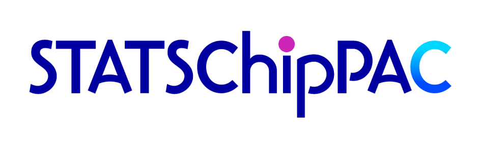
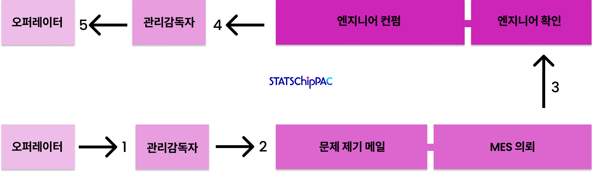
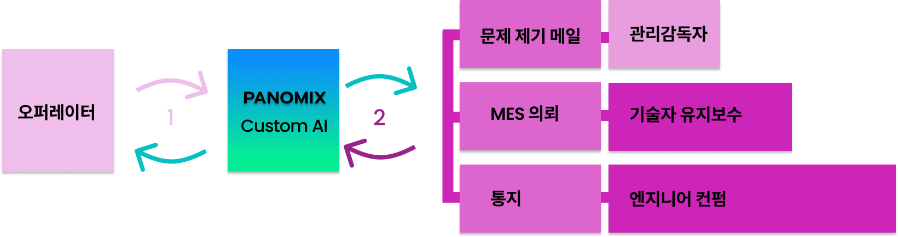
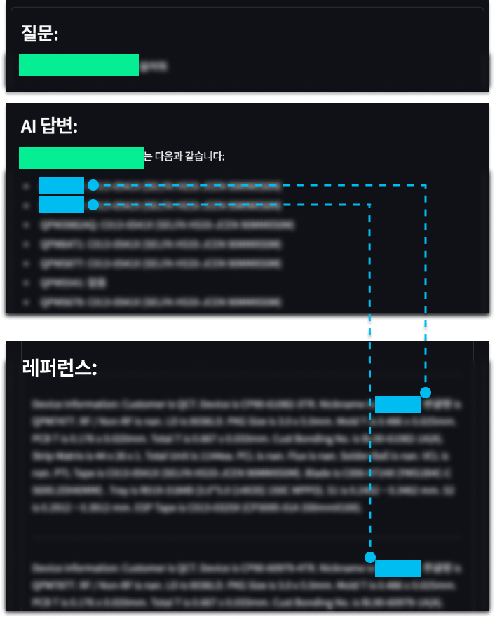

# AI로 최적화된 철저한 보안의 반도체 기업 공정 프로세스

클라이언트는 반도체 기업으로, 파노믹스 커스텀 AI의 도입을 통해 업무 프로세스를 선형 5단계 → 순환 2단계로 단축하였고, 공정률 향상 및 인건비 절감 등의 사업 성과를 이끌었습니다. 

### <code style="color : aquamarine">AI 과제: Discover</code> 

클라이언트는 공정 중 문제가 발생할 경우 작업자가 매번 담당 엔지니어에게 관련 정보를 전달하고 지침을 받거나, 매뉴얼을 일일이 확인해야만 공정 재개가 가능했습니다.
파노믹스는 클라이언트사의 공정 업무 프로세스를 분석한 후 아래와 같은 문제를 도출하였습니다:

- **담당자 의존도 증가**:
    - 문제 발생 시 엔지니어와의 커뮤니케이션에 의존해야 하며, 공정 지연이 잦았습니다.

- **비효율적인 문제 대응**: 
    - 작업자가 일일이 매뉴얼을 탐색하거나 지침을 기다리는 동안 공정 중단 시간이 길어졌습니다.

- **정보 접근의 한계**: 
    - 문제 해결을 위한 정보가 체계적으로 정리되어 있지 않아, 반복적 질의와 대응이 필요했습니다.

이런 문제들이 누적되며 공정 속도 저하와 품질 관리의 어려움까지 겹치고 있었습니다.

---

### <code style="color : cyan">AI 솔루션: Deliver</code>

파노믹스는 커스텀 AI의 도입을 통해 작업자의 업무 프로세스를 단축 시키기 위해, 즉시 관련정보를 확인하고 정확한 대응 방안을 제공하도록 시스템을 개선하였고, 이를 통해 공정률 향상과 인건비 절감 등의 사업 성과를 기대할 수 있었습니다.

---

### <code style="color : orangered">성과 Performance</code>

- 추가 인력 채용 없이도 운영비용 최적화 달성
- 업무 프로세스 단축으로 생산 효율성 증대
- 공정 중단 없이 연속 가동률 대폭 향상

---

## 기능 소개 Features ##

### **<code style="color : lightskyblue">선형 5단계 → 순환 2단계</code>** ###

##### Process Before: 5-Step Multi-layered Process

##### Process After: 2 Cyclic Processes

### **<code style="color : lightskyblue">커스텀 GPT 기반 UI</code>** ###

파노믹스 커스텀 AI는 고객 전용 RAG(검색 증강 생성) 모델을 기반으로, 정확한 정보에 입각한 답변을 생성합니다.

고객의 니즈에 맞춰 채팅창, 질문/답변형 웹 서비스 등 다양한 UI로 제공됩니다.

마이크로소프트 Azure 클라우드를 활용하여 도메인 화이트리스트, MFA(다중 인증) 로그인 등 보안 기능을 통해 안전하고 통제된 환경에서 운영됩니다.

