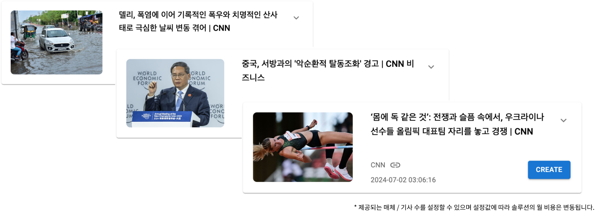
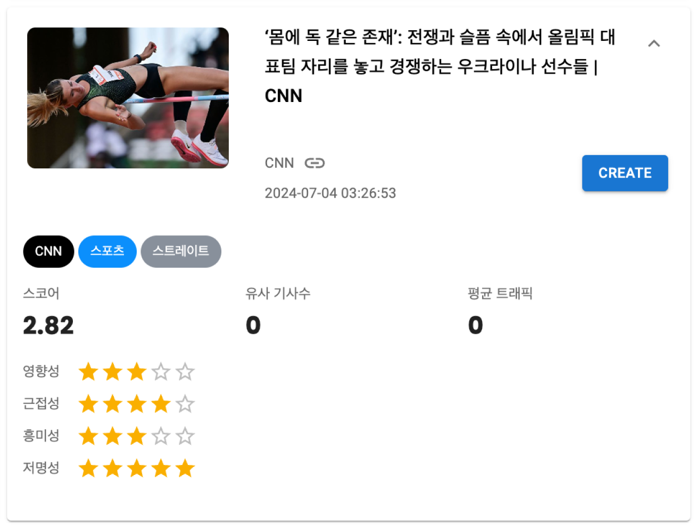
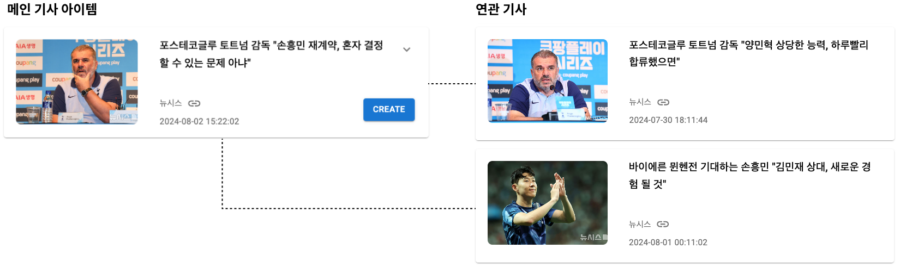
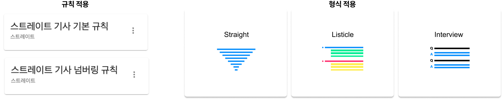
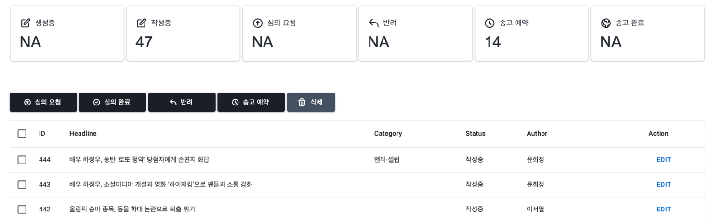
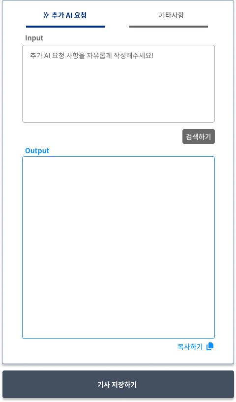
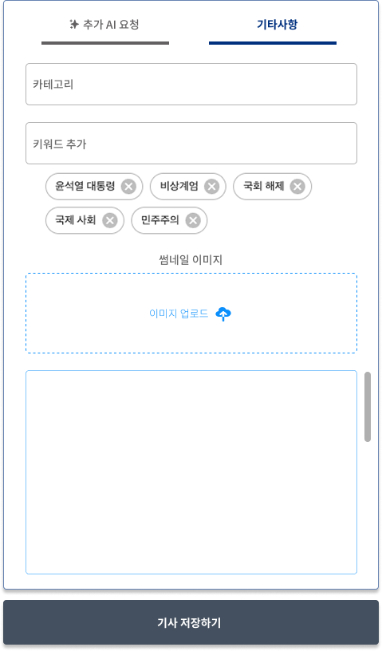

# **스웬 AI - 추가 인력 고용 비용을 절감한 뉴스 어시스턴트**

스웬은 다양한 소스로부터 기사 아이디어를 제공하고, 기사 초안을 작성하며, 기사의 데스킹까지 관리할 수 있도록 돕는 뉴스 생성 어시스턴트입니다. 스웬은 반복적이고 시간 소모적인 작업을 자동화하여 추가 인력 채용에 드는 비용을 효과적으로 절감합고, 기자가 콘텐츠의 퀄리티 향상에 더욱 집중할 수 있도록 도와줍니다.

### Introducing Swen ###

      <iframe style="width: 100%; aspect-ratio: 16 / 9" src="https://www.youtube.com/embed/kIkpnR-KD88?si=gAcIq4hVWC7RGnFz" title="YouTube video player" frameborder="0" allow="accelerometer; autoplay; clipboard-write; encrypted-media; gyroscope; picture-in-picture; web-share" referrerpolicy="strict-origin-when-cross-origin" allowfullscreen></iframe>

[스웬 바로가기](https://swen-ai.com/)

### <code style="color : aquamarine">AI 과제: Discover</code> ###

클라이언트는 뉴스를 다루는 미디어 기업으로, 파노믹스는 클라이언트사 기자들의 기사 작성 프로세스를 분석한 후 아래와 같은 문제를 도출하였습니다.

**신뢰할 수 있는 출처 확보의 어려움**
  - 기사 작성 전 신뢰할 수 있는 출처를 찾고 검증하는 데 많은 시간이 소요되고 있었습니다.
**주제 선정과 정보 정리의 부담**
  - 시의적절한 주제를 선정하고 방대한 정보를 효과적으로 정리하는 과정이 비효율적이였습니다.
**초안 작성의 비효율성**
  - 초안 작성에 많은 리소스가 투입되어, 결국 하루 생산 가능한 기사 수가 제한이 되고 있었습니다.

이로 인해 **뉴스 생산 효율성**과 **콘텐츠 확장성** 모두에 병목이 발생하고 있었습니다.

---

### <code style="color : cyan">AI 솔루션: Deliver</code> ###

파노믹스는 기자들의 기사 작성 프로세스를 효율화하기 위해, AI 기반 자동화 시스템을 새롭게 설계하고 구현했습니다.
AI 기반 수집·필터링과 규칙화된 초안 생성 기능을 구현하고, 기자가 편집하기 쉬운 협업 인터페이스를 제공해 생산성과 퀄리티를 동시에 높일 수 있었습니다.

---

### <code style="color : orangered">성과 Performance</code> ###

- 기자 1인당 하루 평균 기사 수 2배 이상 증가
- 스웬이 생성한 기사로만 누적 1억 뷰 이상 기록
- 기사 작성 소요 시간 80% 이상 단축
- 트렌드 대응 속도 개선으로 더 많은 실시간 콘텐츠 생산 가능

## **기능 소개 Features** ##

### **<code style="color : lightskyblue">다양한 뉴스 소스 제공</code>** ###

해외 외신, 커뮤니티, SNS 등 다양한 기사 아이템을 대시보드 형태로 제공합니다. 뉴스 API 제공자 등 다양한 소스에서 뉴스를 받아 실시간으로 업데이트하고, 외신 기사 등을 포함해 외국어로 작성된 콘텐츠는 한국어로 번역해 사용자에게 제공합니다.

{style="margin-top: 40px"}

---

### **<code style="color : lightskyblue">뉴스 아이템 스코어링 시스템</code>** ###

기자의 판단이 중요한 시의성을 제외하고, 뉴스의 중요도를 판단하는 영향성, 근접성, 흥미성, 저명성을 다양한 머신러닝 기법으로 평가합니다.

기준을 정해 일정 점수 이상의 뉴스 아이템들만을 선별적으로 디스플레이 할 수도 있습니다. 이를 통해 소재 발굴에 소요되는 시간을 단축하고 기사의 퀄리티를 높이는 데 집중할 수 있습니다.

---

### **<code style="color : lightskyblue">AI 검색 / 카테고리 필터</code>** ###

파노믹스의 아티클 RAG(고급 검색 증강 생성)와 Microsoft Azure 클라우드의 AI 검색 기능을 탑재해, 고도화된 검색 방식으로 다양한 기사 아이템들을 검색할 수 있습니다. 또한, 카테고리 필터를 통해 기자별도 담당 카테고리의 기사만을 확인할 수도 있습니다.

---

### **<code style="color : lightskyblue">유사 기사 / 연관 기사 검색</code>** ###

기사 작성을 위해 타 매체들의 유사 기사 및 연관 기사를 AI 검색을 통해 쉽고 빠르게 제공합니다. 검색결과를 AI 기사 드래프트 과정에 활용할 수도 있습니다. AI는 중심 기사와 함께 연관 기사를 포함해 새로운 관점과 풍부한 스토리가 담긴 기사 초안을 작성합니다.

---

### **<code style="color : lightskyblue">기사 형식 / 규칙 적용</code>** ###

스트레이트, 리스티클 등 선택된 메인 기사와 유사/연관 기사들에 따라 기자가 기사의 포맷을 판단하고 설정하면, AI가 이에 맞는 기사 생성을 지원합니다. 또한, 각 매체가 가진 기사작성 방침을 추가로 적용해 AI가 이에 기반해 초안을 작성하도록 합니다.

---

### **<code style="color : lightskyblue">데스킹</code>** ###

심의 요청부터 송고까지의 데스킹 프로세스를 쉽게 관리할 수 있도록 지원합니다. Swen AI는 기사의 정확성과 공정성, 품질까지 보장할 수 있도록, 심의 요청, 수정, 검토, 승인, 그리고 최종 송고까지의 모든 단계를 효율적으로 관리합니다.

---

### **<code style="color : lightskyblue">AI 내용 생성</code>** ###

기사 작성 과정에서 기자는 커스텀으로 AI를 활용하여 필요한 내용을 부분적으로 생성하거나 기사 내용을 보완할 수 있습니다.

|  |  |
|:--:|:--:|

---

### **<code style="color : lightskyblue">아카이브 기사 검색</code>** ###

매체가 보유하고 있는 방대한 기존 기사의 데이터베이스와 Swen의 RAG 및 벡터 데이터베이스가 연결될 수 있도록 지원합니다. RAG 생성이 완료되면 이전 기사들과 새로운 기사 아이템을 조합한 새로운 기사가 탄생합니다. 또, AI 검색을 활용해 과거 기사를 검색하고, 당시 독자들의 반응이나 기사 내용을 참고해 다양한 관점을 제시할 수 있습니다.

---
## **문의하기** ##
  ### 파노믹스와의 협업을 원하신다면, 간단한 정보를 남겨주세요.
  
  👉 <a href="[https://your-google-form-link.com](https://forms.gle/Jpzzf9gE25yAwJBWA)" target="_blank">구글폼 작성하기</a> 또는 
  <a href="mailto:info@panomix.io">info@panomix.io</a>로 메일 주세요.
