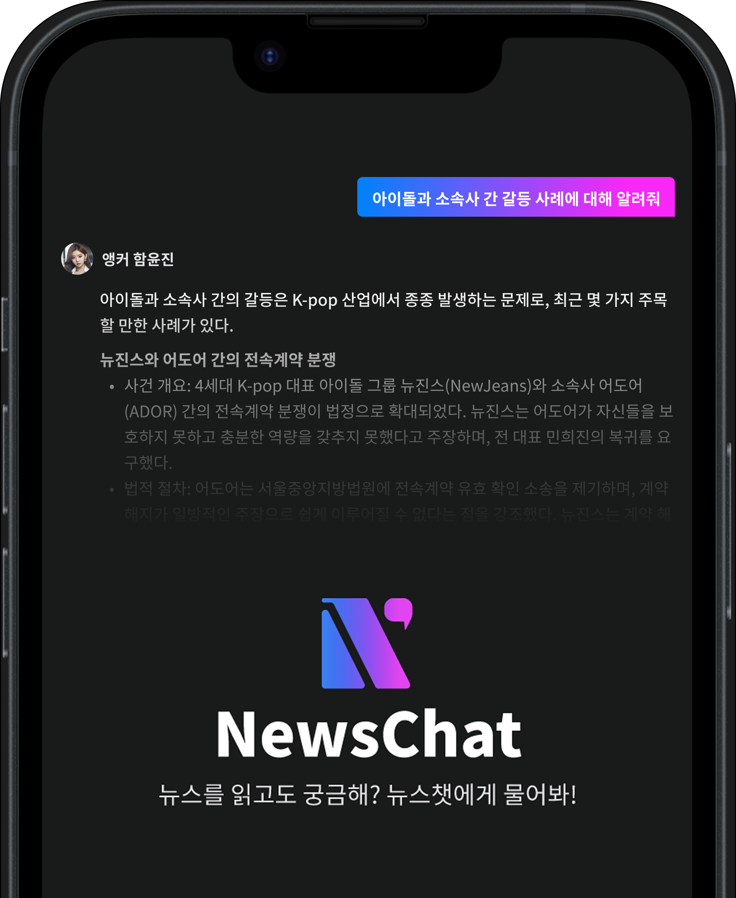
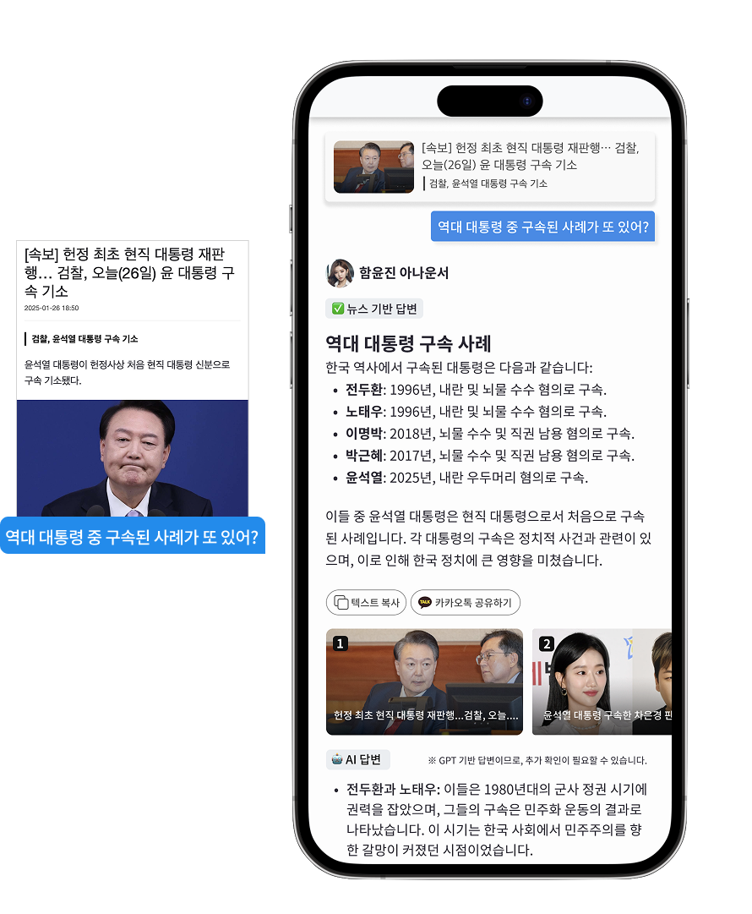
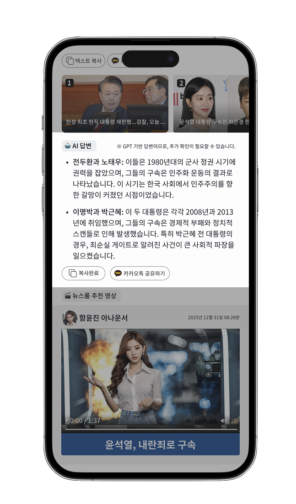
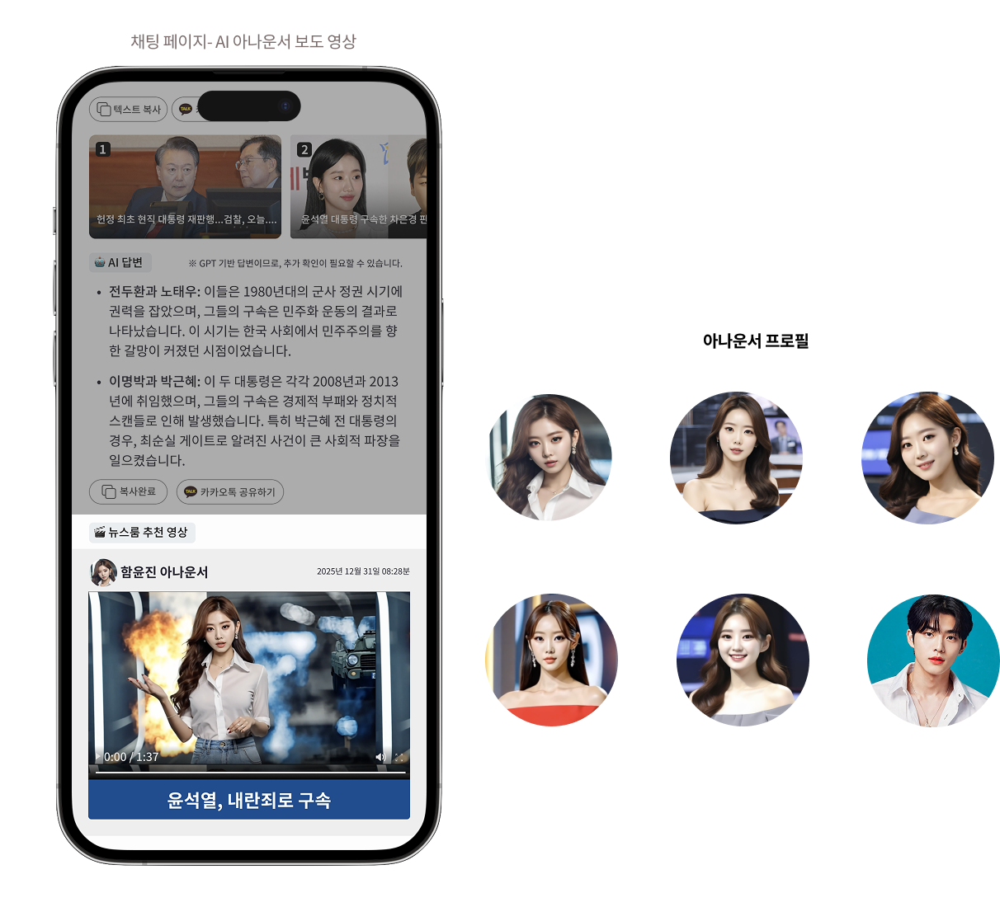
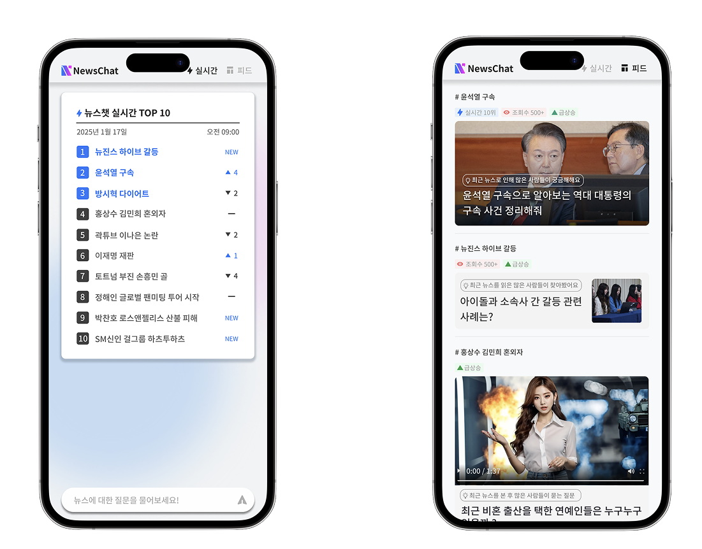

# **국내 언론사 최초의 대화형 생성형 AI, 뉴스챗**

뉴스챗은 뉴스를 읽고 떠오른 궁금증을 즉시 해소하며,
신뢰도 높은 기사 기반 답변과 AI 아나운서의 보도 영상을 넘나드는 다양한 정보 형태로 풍부하고 몰입감 있는 뉴스 소비 경험을 선사합니다.

뉴스챗 바로가기: [https://newschat.wikitree.co.kr/]

---
### <code style="color : aquamarine">Discover</code>

클라이언트는 기존 뉴스 플랫폼의 한계를 다음과 같이 인식하고 있었습니다:

-  **뉴스 소비 흐름의 다변화**:
최근 세대는 뉴스를 전통적인 플랫폼뿐만 아니라 SNS, 유튜브, 커뮤니티 등 다양한 채널을 통해 접하고 있습니다. 이런 환경에서 기존 한정된 뉴스 사이트만으로는 새로운 트래픽을 유입시키고, 사용자의 만족도를 높이기가 어려운 상황이었습니다.

-  **일방향적인 뉴스 소비**:
기존 뉴스 사이트로 독자들은 기사 내용을 소비하는 것에 그칠 뿐, 읽는 도중 떠오른 궁금증을 즉시 해결할 수 있는 수단에 대한 니즈가 존재했습니다.

-  **체류 시간과 수익 지표의 정체**:
이탈률이 높고 광고 수익 또한 하락하는 문제가 있었습니다.

클라이언트는 단순히 기사를 읽는 데서 끝나지 않고, 유저가 뉴스를 중심으로 질문하고 답변을 주고받는 상호작용하는 뉴스 소비 경험을 만들고자 했습니다.

---

### <code style="color : cyan">Deliver</code>

파노믹스는 클라이언트가 직면하고 있는 문제를 해소하기 위해, 유저와 AI의 뉴스 채팅을 목표로 한 **NewsChat 뉴스챗**을 설계하고 구현했습니다.

단순히 기술을 도입하는 데 그치지 않고, 실제 클라이언트의 유저 그룹과 유저 여정, 행동 데이터까지 면밀히 분석한 후, 이를 기반으로 지속 가능한 수익 구조와 트래픽 선순환 구조를 성공적으로 구축했습니다. 

---

### <code style="color : orangered">Performance</code> 

- MAU 100만 명 돌파 (5개월)
- 세션당 기사 조회 수 & 광고 수익 증가
- 브랜딩 관점에서 AI를 통한 새로운 시도로 유저 경험과 만족도 상승
- 뉴스챗으로 유입된 유저들이 다시 추가 기사 소비를 할 수 있는 트래픽 선순환 구조 확보
- 클라이언트 및 뉴스챗 유저 피드백을 기반으로, 지속적인 업데이트와 콘텐츠 품질 향상으로 성장을 이어가는 중

---

## Features 기능 소개 ##

### **<code style="color : lightskyblue">뉴스 기반 답변</code>** ###

  뉴스챗은 신뢰도 높은 뉴스만을 기반으로 답변을 생성합니다. 궁금증이 파생된 원본 기사의 문맥을 분석해, 키워드 검색이 아닌 정확하고 연결된 답변을 제공합니다.

  유저가 기사를 읽고 궁금한 내용을 입력하면, 뉴스챗이 **해당 뉴스 콘텐츠만을 기반으로** 신뢰도 높은 답변을 제공하며, 허위 정보나 외부 지식 오용 방지를 위해 철저하게 범위 제한합니다.

  또한, 뉴스챗의 답변은 사용자 친화적인 마크다운 기반 포맷으로 제공되어 가독성이 뛰어나며, 유저는 핵심 정보를 빠르게 파악할 수 있습니다.

 
### **<code style="color : lightskyblue">AI 답변</code>** ###

  뉴스챗은 AI 답변으로 사실 전달을 넘어서, 이슈에 대한 배경, 의미, 시사점까지 자유롭게 서술하며, 뉴스를 입체적으로 바라볼 수 있는 지적 즐거움을 제공합니다.

### **<code style="color : lightskyblue">AI 아나운서 보도 영상</code>** ###

  뉴스챗의 답변은 텍스트뿐 아니라, 매력적인 AI 아나운서의 뉴스 브리핑 영상과 함께 제공됩니다.
중요한 이슈를 영상으로 빠르게 요약해주며, 직관적인 이해와 몰입감 있는 뉴스 소비를 가능하게 합니다.

### **<code style="color : lightskyblue">통합형 뉴스 포털 기능</code>** ###

  뉴스챗의 ‘실시간’ 및 ‘피드’ 페이지에서는 여러 기사 기반 궁금증과 이슈를 확인할 수 있어,  새로운 형태의 뉴스 노출 창구이자 독립적인 포털 플랫폼으로 기능하기도 합니다.
  

### **<code style="color : lightskyblue">관련 기사</code>** ###

  뉴스 답변 하단에 노출되는 관련 기사들은 유저가 타 기사로 자연스럽게 유도될 수 있도록 설계되어있습니다. 이를 통해 유저가 기사와 뉴스챗을 자유롭게 오가며, 자연스러운 트래픽 선순환 구조를 형성합니다. 

