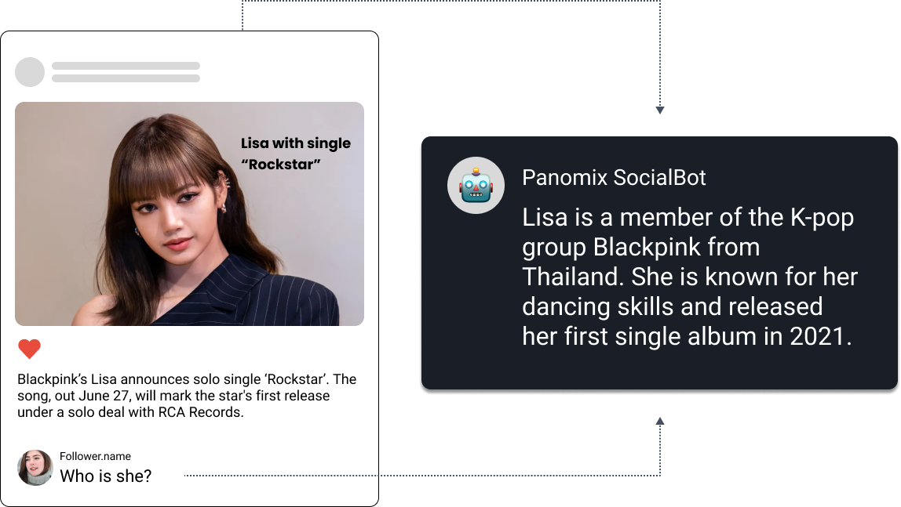
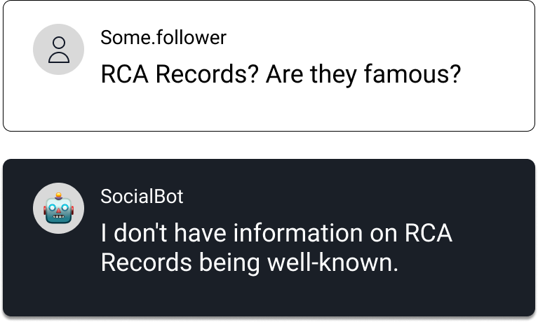
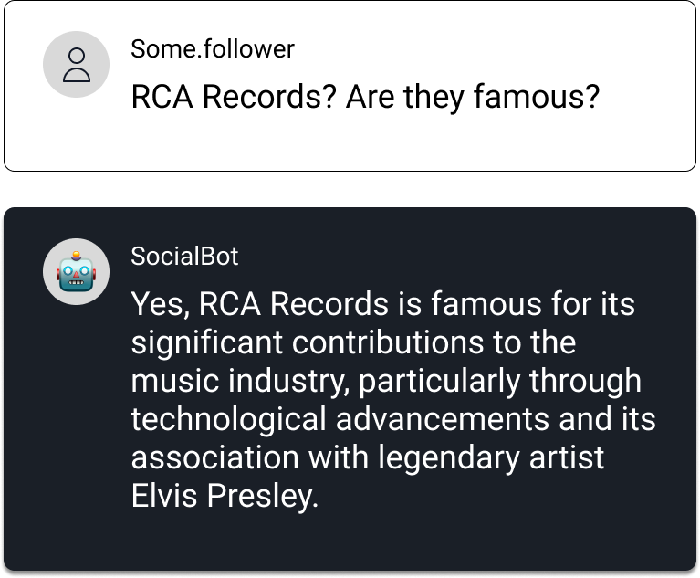
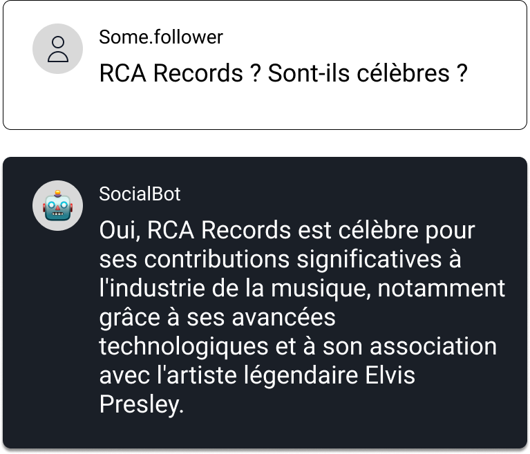

# **소셜봇: 감소하는 SNS 오가닉 노출을 소비자와 AI의 인터랙션 유도로 반등시키다**

파노믹스 소셜봇은 소셜 미디어 채널의 효과적인 관리를 돕는 툴입니다. 리소스 부족으로 직접 응대가 어려웠던 팔로워들의 댓글과 DM 모두를
LLM 기반의 AI로 사람처럼 관리할 수 있고, 
이를 통한 실질적인 채널의 성장도 기대할 수 있습니다.

      <iframe style="width: 100%; aspect-ratio: 16 / 9" src="https://www.youtube.com/embed/T5rBtcD8A_Q?si=4gY7EtuXHBh9j0um" title="YouTube video player" frameborder="0" allow="accelerometer; autoplay; clipboard-write; encrypted-media; gyroscope; picture-in-picture; web-share" referrerpolicy="strict-origin-when-cross-origin" allowfullscreen></iframe>

---

### <code style="color : aquamarine">AI 과제: Discover</code> ###

클라이언트는 정치, 경제 등 민감한 주제를 다루는 SNS 채널을 운영하고 있습니다.  
하지만 다음과 같은 문제로 인해 **소셜 채널의 유기적 노출(Organic Impression)이 지속적으로 하락**하고 있었습니다:

- **유기적 도달률의 지속적 하락** 
  - Instagram, Facebook 등 주요 플랫폼에서 콘텐츠가 자연스럽게 노출되지 않고 있었습니다.
- **사용자 소통의 부재** 
  - 댓글에 즉시 대응할 수 있는 체계가 없어, 참여 유도가 어려웠습니다.
- **대응 인력의 한계** 
  - 쏟아지는 댓글 수를 수작업으로 관리하기엔 인력이 부족하고, 운영자의 악성 댓글 대응 부담도 컸습니다. 또한 부적절한 대응은 브랜드 이미지에도 부정적인 영향을 미칠 우려가 있었습니다.

사전 데이터 분석을 통해, **댓글 수와 유기적 노출량 사이의 강한 양의 상관관계**를 확인하여 액션 플랜에 반영하였습니다.

---

### <code style="color : cyan">AI 솔루션: Deliver</code> ###

파노믹스는 클라이언트를 위한 맞춤형 **소셜봇**를 설계하고 배포했습니다. AI 전담 계정이 뉴스 맥락을 파악해 자동 댓글을 남기고, 관리자 태그로 쉽게 제어할 수 있어 사용자 참여를 유도하고 운영 효율을 높이는 방식을 구현했습니다.

---

### <code style="color : orangered">성과 Performance</code> ###

- **소셜봇이 작성한 댓글 수: 78,000건 이상**
- **자연 노출(Organic Impression) 9.2% 이상 증가**
- **댓글을 통한 사용자 반응 유도 및 악성 대응 리스크 감소**
- **기존 콘텐츠 재활성화 및 알고리즘 노출 최적화에 기여**

## 기능 소개 Features ##

### **<code style="color : lightskyblue">게시물과 사용자의 댓글을 이해</code>** ###

파노믹스 소셜봇은 Vector DB, OCR, 이미지 및 텍스트 분석 등을 포함한 다양한 기술로 게시물의 내용을 이해합니다.

예를 들어, 사용자가 "그녀는 누구인가요?"라고 댓글을 남기면, 봇은 게시물의 맥락을 바탕으로 추가 정보 없이도 정확하게 답변할 수 있습니다.

{style="margin-top: 20px"}

---

### **<code style="color : lightskyblue">AI 댓글의 완벽한 제어</code>** ###

파노믹스 소셜봇은 사용자 질문에 정확하게 답변하기 위해 신뢰할 수 있는 출처에서만 정보를 수집합니다. 정보를 찾을 수 없을 경우, AI는 아는 척하지 않고 솔직하게 답을 모른다고 답변할 수 있습니다.
{style="margin-top: 20px"}

---

### **<code style="color : lightskyblue">추가 정보 검색</code>** ###

신뢰할 수 있는 미디어 소스를 추가하여 AI의 지식을 확장할 수 있습니다.

사용자 댓글을 기반으로 추가 정보가 필요할 경우, 시스템은 신뢰할 수 있는 출처의 기사에서 정보를 가져와 응답을 생성합니다.
{style="margin-top: 20px"}

---

### **<code style="color : lightskyblue">다국어 지원 및 24/7 운영</code>** ###

파노믹스 소셜봇은 다국어를 지원하며 상시운영을 통해언제나 사용자와 지속적으로 상호작용 할 수 있습니다.

{style="margin-top: 20px"}

---

### **<code style="color : lightskyblue">모니터링 및 안전 보호</code>** ###

파노믹스는 고객의 브랜드 가치를 소중하게 생각합니다.

AI의 톤앤 매너를 각각의 브랜드에 맞게 조정할 수 있는 테스트 플레이그라운드를 제공합니다. 또한, 슬랙이나 구글 챗과 같은 메신저에 연결해 대화를 실시간으로, 더 세밀하게 모니터링 할 수도 있습니다.

---

### **<code style="color : lightskyblue">데이터 거버넌스</code>** ###

파노믹스 소셜봇은 Microsoft Azure 클라우드 기반으로, 대규모 언어 모델(LLMs)의 활용을 위해 Azure OpenAI와 연결됩니다.

Azure OpenAI는 고객 데이터의 보안과 정보보호에 최우선해 OpenAI를 포함한 제3자에 의해 데이터가 사용하지 않도록다양한 안전장치를 보장합니다.
