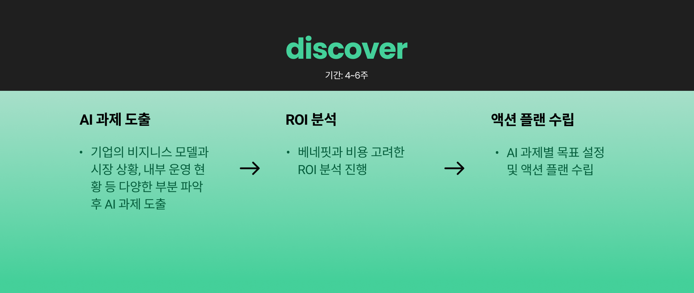
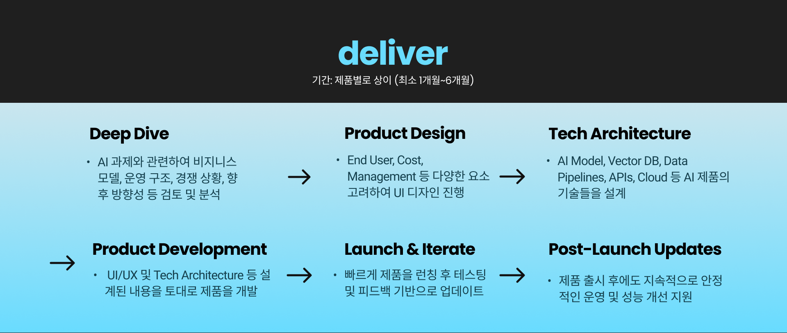

# How We Work
파노믹스는 사용자 경험(UX)에 최적화된 제품 설계를 기반으로, 빠르게 구현하고 지속적으로 개선하는 프레임워크를 지향합니다. 초기 단계에서 실사용자의 니즈와 Pain point를 면밀히 분석해 직관적이고 효율적인 UX를 설계하고, 이를 기반으로 AI 솔루션을 빠르게 개발·구현합니다. 구현 이후에는 실제 사용 데이터를 바탕으로 반복적인 테스트와 개선을 거쳐 제품의 완성도를 높이며, 고객이 짧은 시간 안에 실질적인 가치를 체감할 수 있도록 지원합니다.

# Client-Focused Solutions 
파노믹스의 클라이언트 맞춤형 솔루션은 2가지 단계로 나뉩니다. 

### <code style="color : aquamarine">기업의 비즈니스·시장·운영 현황을 파악해 AI 과제를 도출하고, ROI를 분석해 목표와 실행 계획을 수립합니다.</code> ###

### <code style="color : cyan">제품을 설계하고, AI 모델과 아키텍처를 구현하여 빠른 검증과 개선을 거쳐 성공적으로 출시·운영을 지원합니다.
</code> ###
