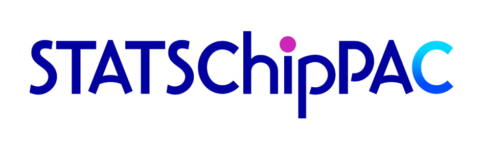
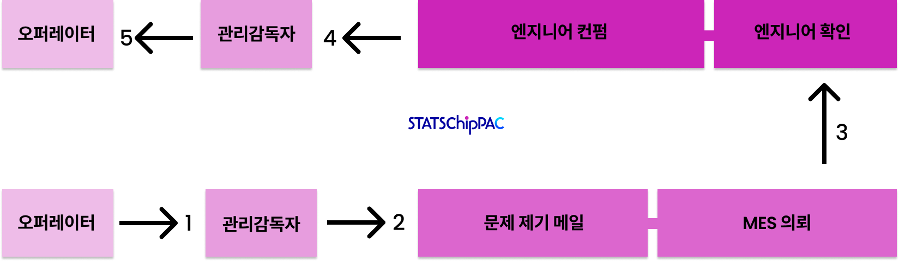
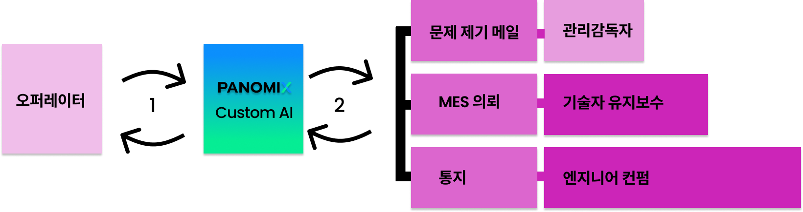
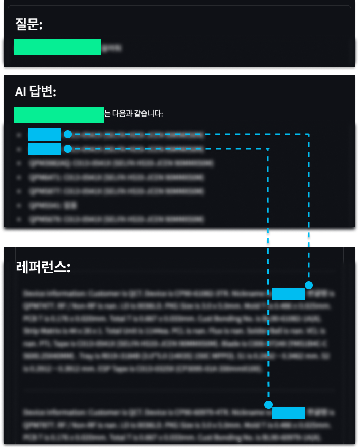

## 스태츠칩팩 코리아

반도체 기업인 스태츠칩팩 코리아는 공정 중 문제가 발생할 경우, 작업자가 매번 담당 엔지니어에게 관련 정보를 전달하고 상황에 따른 지침을 하달 받거나 매뉴얼을 일일히 확인해야만 공정을 재개할 수 있었습니다.

스태츠칩팩 코리아는 파노믹스 커스텀 AI의 도입을 통해 작업자가 문제상황을 입력하면, 즉시 관련정보를 확인하고 정확한 대응 방안을 제공하도록 시스템을 개선하였고, 이를 통해 공정률 향상과 인건비 절감 등의 사업 성과를 기대합니다.

## Process Before: 5-Step Multi-layered Process

## Process After: 2 Cyclic Processes

## 커스텀 GPT 형태의 솔루션

파노믹스 커스텀 AI는 고객 전용 RAG(검색 증강 생성) 모델을 기반으로, 정확한 정보에 입각한 답변을 생성합니다.

고객의 니즈에 맞춰 채팅창, 질문/답변형 웹 서비스 등 다양한 UI로 제공됩니다.

마이크로소프트 Azure 클라우드를 활용하여 도메인 화이트리스트, MFA(다중 인증) 로그인 등 보안 기능을 통해 안전하고 통제된 환경에서 운영됩니다.

