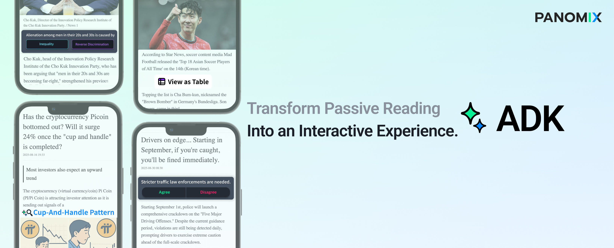
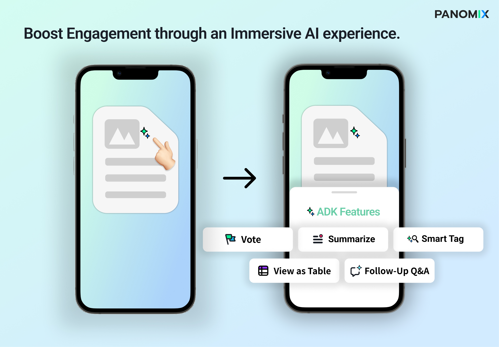

# **Boost reader engagement - Encourage interaction by implementing immersive AI features.**

ADK is an interaction layer that provides news readers with an immersive AI experience.
Through various features, ADK delivers in-depth information beyond the articles, enables reader to explore social reactions, and provides rich content experiences, effectively increasing reader engagement and session duration. 

We are currently recruiting free beta testers!
👉 <a href="https://forms.gle/58WYd59pJY5M8zV89" target="_blank">Register Now</a>

---
## *<code style="color : aquamarine">ADK is designed for the following organizations that face specific challenges.</code>* ##

- Brands that want to integrate AI seamlessly without disrupting their existing content flow or branding
- Small to medium media companies that want to develop their own AI products but lack internal resources
- Companies concerned about the risks and costs of adopting AI
- Companies that prioritize increasing engagement and reducing churn on existing content rather than driving traffic to new product platforms

Many companies in the media industry are increasingly facing challenges such as declining user engagement and higher content churn, highlighting the limitations of a unilateral information flow.
ADK assists these organizations to enhance reader experience without interrupting content flow. By promoting immersion and interaction, ADK improves key business metrics such as page session duration as well as retention, providing a practical AI solution to address these challenges.
---

## **ADK Feature Overview** ##

### **<code style="color : lightskyblue">Summary</code>** ###
- Summarizes lengthy articles or reports in a concise paragraph

### **<code style="color : lightskyblue">Smart Tag</code>** ###
- Selects and tags key terms or complex concepts extracted from content, providing reader with definitions or contextual information

### **<code style="color : lightskyblue">Vote</code>** ###
- Presents binary-choice topics related to the content, enabling readers to vote and participate with real-time voting results with additional insights
  
### **<code style="color : lightskyblue"> Follow-Up Q&A </code>** ###
- Provides Q&A formatted insights that users may have while reading content
  
### **<code style="color : lightskyblue">View as Table</code>** ###
- Visualizes text such as numbers, data, rankings etc. that are difficult to grasp from text alone to tables

### **Additional Options** ###
- Additional options such as adding a real-time chat feature or customizing UI ( colors, fonts etc. ) requires prior consultation with the team and may incur additional costs.
---

## **Expected Outcome & Benefits** ##
Our other platform, NewsChat, launched in January, follows a user flow similar to ADK. It has increased user session duration by up to ~250%. Since ADK is designed with a comparable flow and structure, we can expect similar results.

⏳ ** 150~200% Increase in Session Duration**

- AI interactions are designed to be placed within articles, decreasing drop-off rates and boosting session duration. 

💴 **Up to 30% Increase in Revenue per Page View**

- Boost in session duration is expected to lead to higher revenue per Page View
  
⚙️ **Automated Work Flow, Little to no Development Resources Required**

- ADK analyzes article content and generates  context-aware AI interaction features.
- Integration of ADK is as simple as adding a single line of script, while preserving the website’s existing content environment

🎯 **Branding Enhancement**

- Early adoption of AI technology builds reader trust in media as “forward thinking” and delivers new partnership values and opportunities to advertisers 

↩️ Generation of Follow-Up Content Ideas

- Data collected through ADK (ex: Poll results, click ) can be used for feedback/reference information for subsequent article topics

🎨 **UI/UX**

All UX interactions happen within  whichever article the user is reading, with no redirects to other pages or platforms. 
- In-page structure meets readers’ needs to explore for additional information without the pain points of having to leave the page to perform web search 
- Integrates AI without disrupting content flow , reducing users’ resistance to new features

---
## **Contact Us** ##
### Interested in working with us? ###
  
👉 <a href="https://forms.gle/58WYd59pJY5M8zV89" target="_blank"> Try beta for free </a> Or feel free to reach out for a free demo at
<a href="mailto:info@panomix.io">info@panomix.io</a>.

