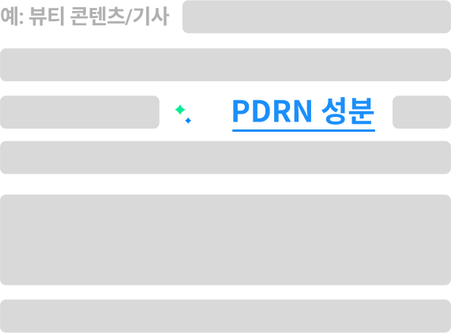
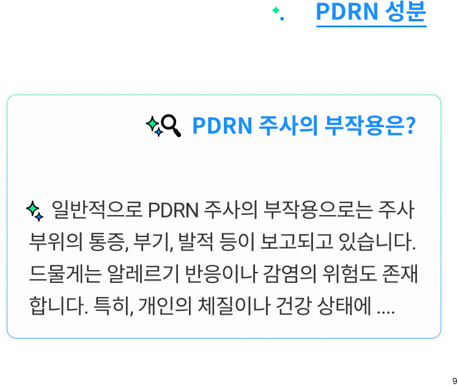
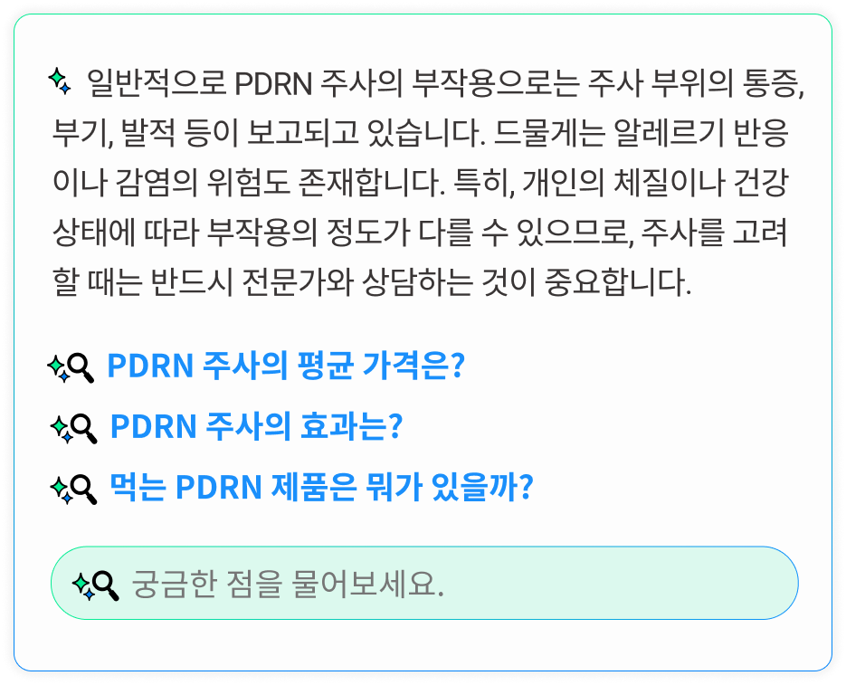
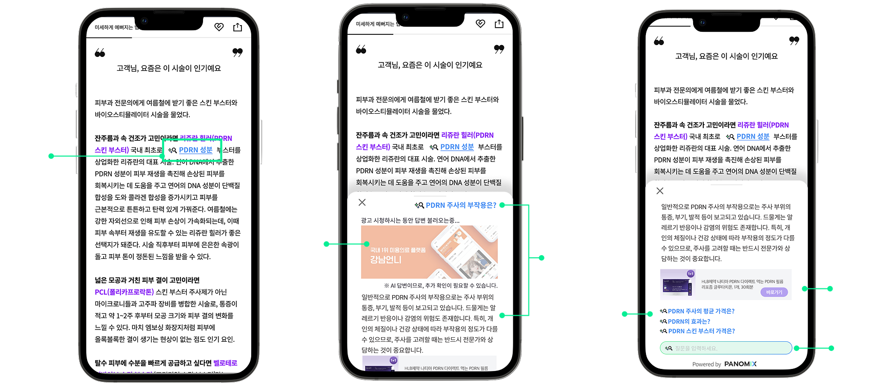
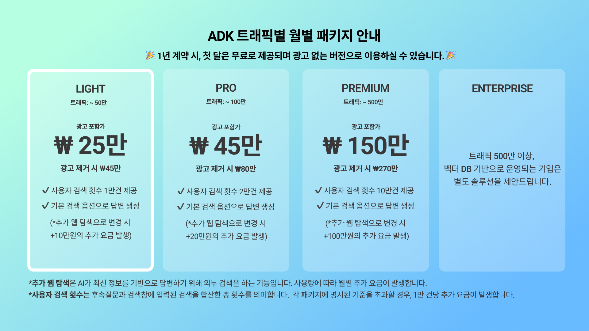

# **ADK - 기존 미디어 콘텐츠에 자연스럽게 녹아드는, 이탈 없는 최적의 유저 경험을 위한 AI**

ADK는 문맥 속 핵심 키워드를 스마트 태깅하고, 질의응답과 인터랙션을 제공해 콘텐츠 몰입도와 체류시간을 효과적으로 증가시킵니다.

### ADK 데모 영상: 콘텐츠에 자연스럽게 녹아드는 AI, 직접 확인해보세요. ###

<iframe width="500" height="800"  src="https://www.youtube.com/embed/hRPxOj6KHJg" title="[파노믹스] ADK - 기존 미디어 콘텐츠에 자연스럽게 녹아드는, 최적의 유저 경험을 위한 AI 서비스" frameborder="0" allow="accelerometer; autoplay; clipboard-write; encrypted-media; gyroscope; picture-in-picture; web-share" referrerpolicy="strict-origin-when-cross-origin" allowfullscreen></iframe>

---
*<code style="color : aquamarine">ADK는 이런 기업/단체를 위해 설계되었습니다.</code>*

-  기존 콘텐츠 흐름이나 브랜딩을 해치지 않고, 눈에 띄게 않게 AI 도입을 하고 싶은 매거진형 브랜드
-  자체 AI 프로덕트를 개발하고 싶지만 내부 리소스가 부족한 중소 매체사
-  AI 기술 도입에 대한 리스크나 비용 부담을 느끼는 기업
-  신규 AI 프로덕트로의 트래픽 확장보다는 기존 콘텐츠의 체류시간 증가와 이탈 방지에 더 무게를 두는 기업

일방향적 정보 전달에 한계를 느끼고, 콘텐츠 이탈률과 체류시간 감소라는 과제를 안고 있는 기업들과 서비스 운영자들이 늘고 있습니다. 이러한 문제를 직면한 기업들을 위한 ADK는 콘텐츠의 흐름을 해치지 않으면서도 사용자 경험을 확장하고, 몰입과 인터랙션을 유도하여 체류시간 증가, 이탈률 감소와 같은 실질적 비즈니스 지표를 개선할 수 있도록 설계된 AI 솔루션입니다.

---

## **기능 소개 Features** ##
 

### **<code style="color : lightskyblue">AI 스마트 태깅</code>** ###

  콘텐츠 내용을 파악한 후, 본문에서 핵심 키워드를 셀렉하여 자동으로 태그를 삽입합니다.
  
 

---
 
### **<code style="color : lightskyblue">이탈없는 실시간 AI 답변</code>** ###

  키워드를 클릭하면 관련 질문이 생성되고, 기사 문맥을 바탕으로 실시간 답변이 생성됩니다.
  
 

---

### **<code style="color : lightskyblue">추천 질문 & 사용자 검색</code>** ###

  독자가 더 깊이 있는 탐색을 할 수 있도록 주제와 관련된 후속 질문을 자동 생성합니다. 또한, 검색창을 제공하여 독자가 추가로 궁금한 내용을 입력할시  AI가 즉시 답변을 할 수 있습니다.
 

---
## **ADK Prototype: 한눈에 보는 ADK 작동방식** ##

---
## **ADK is about ...** ##
 **<code style="color : green">...expanding</code> user experience.**
 **<code style="color : green">확장</code> - 기존 콘텐츠 환경은 유지하면서, 별도의 플랫폼 이동 없이 AI로만 확장하는 서비스**

사용자가 머무는 웹페이지 안에 AI를 자연스럽게 심어,점보 탐색과 대화를 위한 새로운 경험을 해당 콘텐츠 흐름 안에서 확장합니다.
+ 페이지를 벗어나지 않는 구조로 이탈률 감소
+ 사용자 체류 시간을 효과적으로 증가
+ 별도의 플랫폼 구축없이, 기존 서비스 위에서 확장되는 가장 자연스러운 서비스 형태

**<code style="color : green">...enhancing</code> user experience.**
**<code style="color : green">고도화</code> - 핵심 키워드를 스캐닝 한 후, 문맥 기반의 궁금증과 AI가 생성하는 답변 제공**

사용자의 궁금증이 없어도, 진정한 고도화를 통해 사용자가 읽고 있는 콘텐츠와 자연스럽게 연결된 가장 관련성 높은 키워드와 질문을 생성하여, 사용자 몰입을 최대한 해치지 않으며 유용한 정보를 제공합니다.

+ 콘텐츠 속 유저가 관심가질 만한 키워드 혹 난해한 개념의 키워드 자동 스마트 태깅
+ AI 질문 및 답변 생성
+ 콘텐츠 이해도와 몰입도 극대화

**<code style="color : green">...engaging</code> user experience.**
**<code style="color : green">인터랙션</code> - 유저의 탐색의지를 자극하며, 능동적인 상호작용으로 이어지도록 인터랙션 설계**

기존의 단순한 정보 소비를 넘어, 사용자가 AI와 능동적으로 상호작용하도록 유도하는 경험을 설계합니다.
+ 콘텐츠 관련 정보 탐색의 계기 제공
+ 유저가 능동적으로 AI 와 상호작용하도록 설계된 유저 플로우
+ 단순 소비에서 몰입형, 자발적 콘텐츠 경험으로 확장

---
## **Expected Outcome 예상 효과 및 베네핏** ##
파노믹스의 또 다른 프로덕트인 뉴스챗은 ADK와 유사한 사용자 흐름을 기반으로 설계된 솔루션입니다. 
올해 1월 출시된 뉴스챗은 **체류시간 (뉴스챗 유저 한정)을 250% 증가**시키는데에 기여할 수 있었습니다. 
ADK 또한 동일한 플로우와 구조를 기반으로 하기 때문에, 유사한 효과를 기대할 수 있습니다. 
AI와의 인터랙션을 통해 사용자의 콘텐츠 몰입도가 높아지고 **페이지 체류시간이 자연스럽게 증가하며**, 독자들은 단순 소비에서 탐색 중심의 소비로 전환되어 **이탈률 또한 효과적으로 줄일 수 있습니다.**

🎨 UI/UX
- 각 매체의 고유의 UI와 독자들이 익숙한 UX 흐름을 존중하여, UX 디스럽션을 최소화한 디자인과 구조로 설계

🙋 독자 만족도 향상
- 콘텐츠 흐름을 끊지 않고, AI가 추가 정보를 제공해 독자의 정보 탐색 니즈 충족
- 이탈 없는 구조 덕분에 페이지 체류 시간과 유저 리텐션 함께 상승
- 익숙한 콘텐츠 흐름 안에서 부드럽게 AI 기능을 경험하게 되어 새로운 서비스에 대한 거부감을 덜어줌

⚙️ 개발 부담 없음
- 개발 리소스 없이 손쉽게 적용 가능하며, 매체사에서 운영 중인 콘텐츠 환경 그대로 유지 가능

🎯 브랜딩 강화
- AI 기술을 선도적으로 도입함으로서 독자에게 ‘앞서가는 미디어'라는 신뢰감, 광고주에게는 ‘차별화된 파트너십 가치’ 전달

---
## **Pricing: 지금 ADK 도입을 시작해보세요.** ##

문의: info@panomix.io
 

