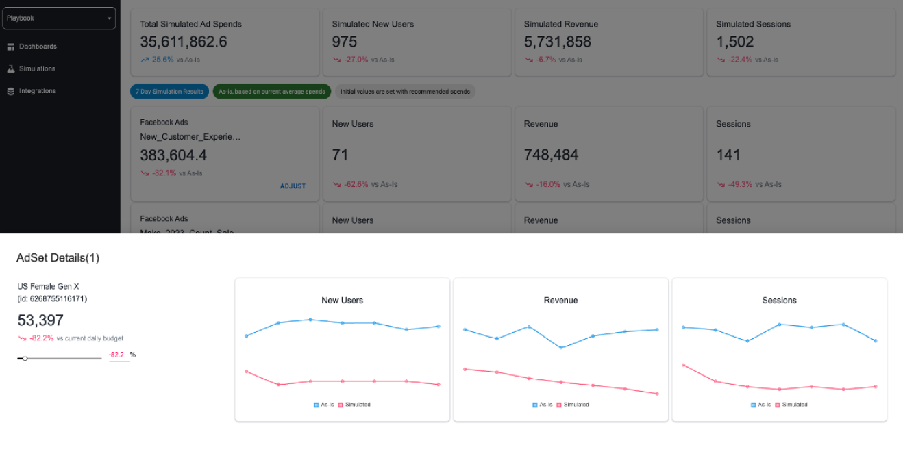

## Simulation

플레이북은 채널 레벨에서만 가능했던 예산 시뮬레이션을 클러스터링 알고리즘을 적용하여 광고 세트 레벨에서 가능하게 합니다. 이를 통해 운영되고 있는 광고 세트에 실시간 예산 조정을 가능하게 합니다.

## Dashboard

플레이북의 대시보드에서 현재 운용중인 전체 마케팅 캠페인의 효과와 효율을 KPI별로 한 눈에 확인할 수 있습니다. 채널, 캠페인, 광고 세트 레벨에서 MMM이 분석한 기여도에 따라 ROAS 등 다양한 KPI들의 Incremental을 확인할 수 있습니다.

## Granularity

플레이북은 채널 레벨의 기여도 측정을 넘어 캠페인/광고 세트 레벨의 기여도 및 시뮬레이션을 제공합니다. 최대 24시간 안에 광고 세트의 일일 광고비를 최적화 할 수 있습니다.

## Automation in Cloud

플레이북은 클라우드 환경에서 머신러닝을 진행합니다. 진화형 알고리즘을 활용해 10만개 이상의 모델을 생성하여 모델 성능(Model Performance) 향상과 모델 편향(Model Bias) 및 편차(Model Variance)를 최소화합니다.

## Proof of Concept

무료로 페이스북과 구글의 기여도를 확인하세요. 약 10만 번의 모델이 알려주는 CPI 혹은 ROAS를 확인해보세요. 또한 10만 번의 최적화 시뮬레이션 결과가 평균 얼마나 광고비를 절약하는지 확인하세요.

{style="margin-bottom: 40px"}
