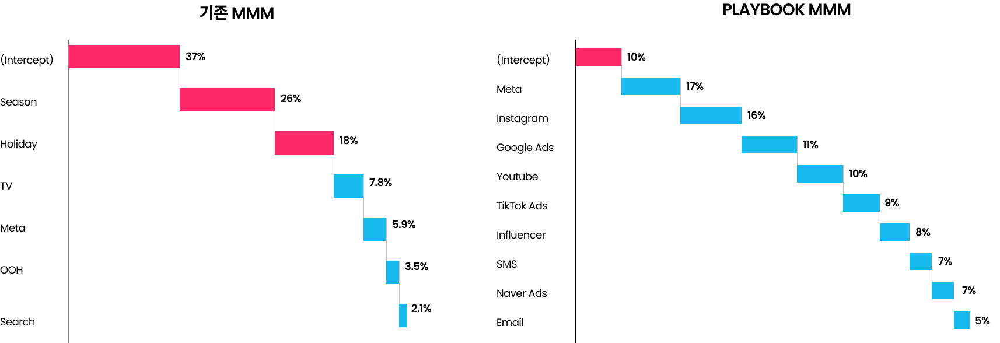

# Playbook

## Overview

플레이북은 메타의 Robyn과 그 외 다수의 머신 러닝 알고리즘이 접목된 Next-Level 미디어 믹스 모델링 분석 솔루션입니다. 또한 클라우드 환경에서 모델 생성을 자동화하여 한번의 모델링이 아닌 수만번의 모델링으로 Bias를 최소화합니다.

## Digital First MMM

MMM은 오래된 광고 성과 측정 방법입니다. 플레이북은 변화된 마케팅 시장에 따라 페이스북 광고, 구글 광고 등의 광고 플랫폼 뿐만 아니라 인스타그램, 유튜브 등 기업의 오가닉 마케팅 채널, SMS와 이메일 등의 CRM 마케팅 등 디지털 환경의 맞는 데이터 파이프라인과 머신러닝 알고리즘들을 통해 기존 MMM의 한계점을 뛰어넘어 서비스합니다.

## Playbook MMM vs Robyn

플레이북은 로컬 환경에서 Adhoc으로 실행하는 Robyn의 한계점을 넘어 클라우드 환경에서 모델 Bias를 최소화하기 위해 최소 1만번 이상 모델링을 진행합니다.

| Feature          | Playbook        | Robyn    |
| ---------------- | --------------- | -------- |
| Automated        | Yes             | No       |
| Model Run        | +10,000 (Multi) | Once     |
| Environment      | Cloud (AWS)     | Local    |
| Auto Update      | Yes             | No       |
| Simulation Level | Channel         | Ad Group |

## Robyn MMM 무료 강좌

Robyn으로 기초 MMM을 진행하고 싶으시면 아래 유튜브 영상들에서 무료로 MMM을 배워보세요.

<iframe style="width: 100%; aspect-ratio: 16 / 9" src="https://www.youtube.com/embed/videoseries?si=xAnPYdaUJrNQGr_O&amp;list=PL8mXq9YlckOo2j6XtGbLmwvOfpBlR_th2" title="YouTube video player" frameborder="0" allow="accelerometer; autoplay; clipboard-write; encrypted-media; gyroscope; picture-in-picture; web-share" referrerpolicy="strict-origin-when-cross-origin" allowfullscreen></iframe>

## Next steps

Learn more about Playbook.

<a href="../features" class="next-step">
    Features
</a>
