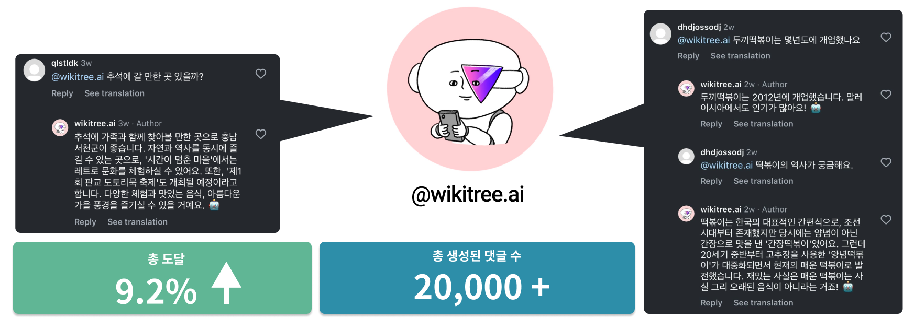

## 위키챗 AI

광학 문자 인식(OCR) 기술을 적용한 이미지 프로세싱을 통해 인스타그램/페이스북 게시글의 이미지를 분석하고, AI가 활용할 수 있는 RAG(벡터 데이터베이스)를 이용해 정확한 정보를 제공하는 AI 소셜 채널 매니저인 위키챗은 지난 3월부터 위키트리의 페이스북 및 인스타그램 계정에서 댓글과 DM을 처리하며 이용자들과 소통하고 있습니다.

{style="margin-top: 20px"}
