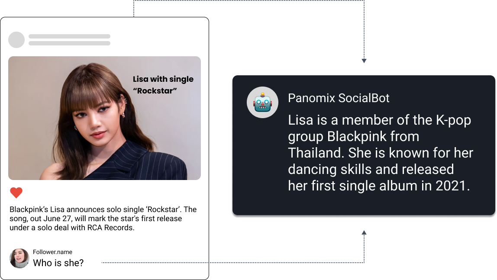
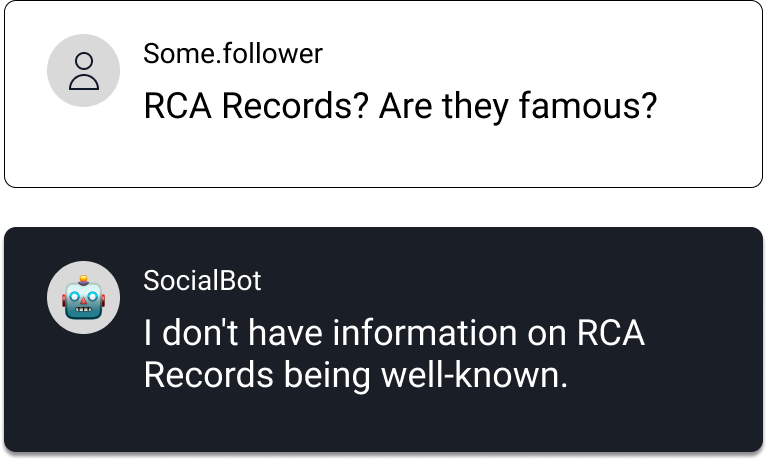
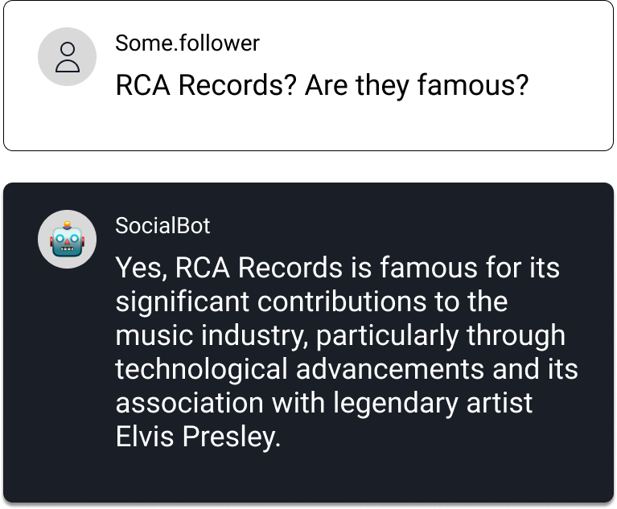
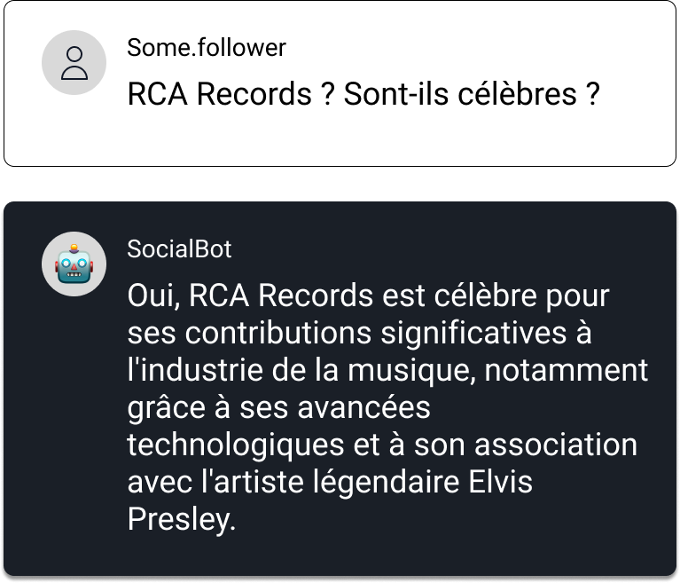

## 게시물과 사용자의 댓글을 이해

파노믹스 소셜봇은 Vector DB, OCR, 이미지 및 텍스트 분석 등을 포함한 다양한 기술로 게시물의 내용을 이해합니다.

예를 들어, 사용자가 "그녀는 누구인가요?"라고 댓글을 남기면, 봇은 게시물의 맥락을 바탕으로 추가 정보 없이도 정확하게 답변할 수 있습니다.

{style="margin-top: 20px"}

## AI 댓글의 완벽한 제어

파노믹스 소셜봇은 사용자 질문에 정확하게 답변하기 위해 신뢰할 수 있는 출처에서만 정보를 수집합니다. 정보를 찾을 수 없을 경우, AI는 아는 척하지 않고 솔직하게 답을 모른다고 답변할 수 있습니다.
{style="margin-top: 20px"}

## 추가 정보 검색

신뢰할 수 있는 미디어 소스를 추가하여 AI의 지식을 확장할 수 있습니다.

사용자 댓글을 기반으로 추가 정보가 필요할 경우, 시스템은 신뢰할 수 있는 출처의 기사에서 정보를 가져와 응답을 생성합니다.
{style="margin-top: 20px"}

## 다국어 지원 및 24/7 운영

파노믹스 소셜봇은 다국어를 지원하며 상시운영을 통해언제나 사용자와 지속적으로 상호작용 할 수 있습니다.

{style="margin-top: 20px"}

## 모니터링 및 안전 보호

파노믹스는 고객의 브랜드 가치를 소중하게 생각합니다.

AI의 톤앤 매너를 각각의 브랜드에 맞게 조정할 수 있는 테스트 플레이그라운드를 제공합니다. 또한, 슬랙이나 구글 챗과 같은 메신저에 연결해 대화를 실시간으로, 더 세밀하게 모니터링 할 수도 있습니다.

## 데이터 거버넌스

파노믹스 소셜봇은 Microsoft Azure 클라우드 기반으로, 대규모 언어 모델(LLMs)의 활용을 위해 Azure OpenAI와 연결됩니다.

Azure OpenAI는 고객 데이터의 보안과 정보보호에 최우선해 OpenAI를 포함한 제3자에 의해 데이터가 사용하지 않도록다양한 안전장치를 보장합니다.

## 고객 성공 사례

<a href="../clientcases" class="next-step">
    Client Cases
</a>
