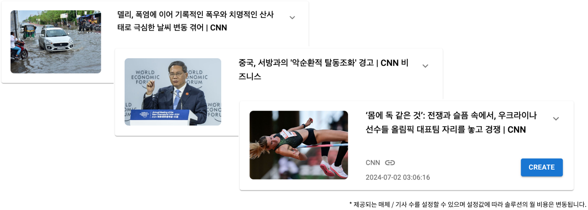
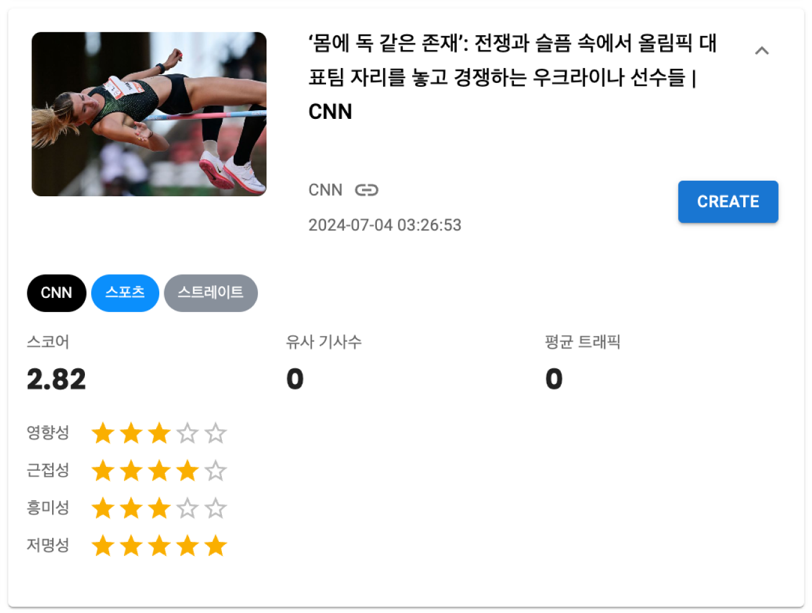
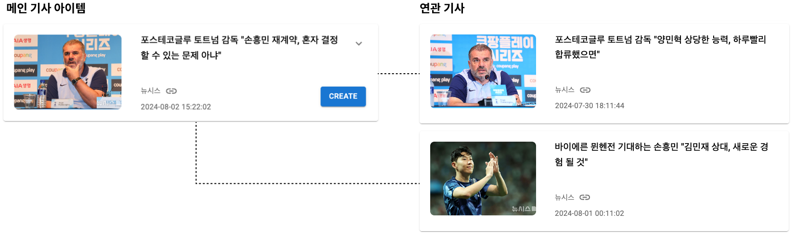
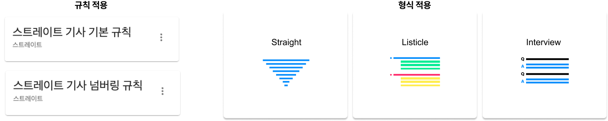
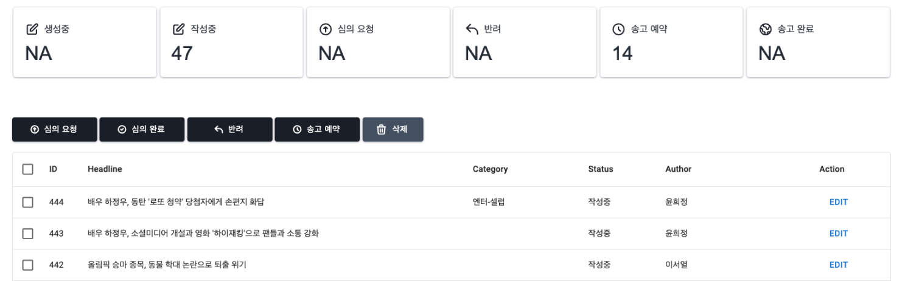
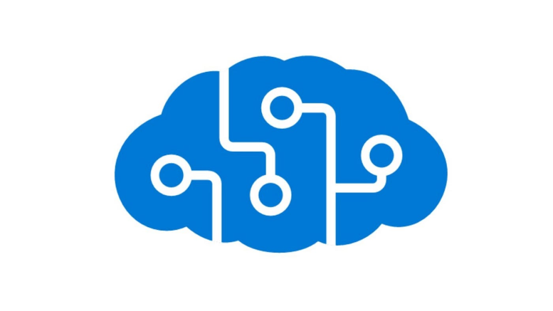

## 다양한 뉴스 소스 제공

해외 외신, 커뮤니티, SNS 등 다양한 기사 아이템을 대시보드 형태로 제공합니다. 뉴스 API 제공자 등 다양한 소스에서 뉴스를 받아 실시간으로 업데이트하고, 외신 기사 등을 포함해 외국어로 작성된 콘텐츠는 한국어로 번역해 사용자에게 제공합니다.

{style="margin-top: 40px"}

## 뉴스 아이템 스코어 시스템

기자의 판단이 중요한 시의성을 제외하고, 뉴스의 중요도를 판단하는 영향성, 근접성, 흥미성, 저명성을 다양한 머신러닝 기법으로 평가합니다.

기준을 정해 일정 점수 이상의 뉴스 아이템들만을 선별적으로 디스플레이 할 수도 있습니다. 이를 통해 소재 발굴에 소요되는 시간을 단축하고 기사의 퀄리티를 높이는 데 집중할 수 있습니다.

## AI 검색 / 카테고리 필터

파노믹스의 아티클 RAG(고급 검색 증강 생성)와 Microsoft Azure 클라우드의 AI 검색 기능을 탑재해, 고도화된 검색 방식으로 다양한 기사 아이템들을 검색할 수 있습니다. 또한, 카테고리 필터를 통해 기자별도 담당 카테고리의 기사만을 확인할 수도 있습니다.

## 유사 기사 / 연관 기사 검색

기사 작성을 위해 타 매체들의 유사 기사 및 연관 기사를 AI 검색을 통해 쉽고 빠르게 제공합니다. 검색결과를 AI 기사 드래프트 과정에 활용할 수도 있습니다. AI는 중심 기사와 함께 연관 기사를 포함해 새로운 관점과 풍부한 스토리가 담긴 기사 초안을 작성합니다.

## 기사 형식 / 규칙 적용

스트레이트, 리스티클 등 선택된 메인 기사와 유사/연관 기사들에 따라 기자가 기사의 포맷을 판단하고 설정하면, AI가 이에 맞는 기사 생성을 지원합니다. 또한, 각 매체가 가진 기사작성 방침을 추가로 적용해 AI가 이에 기반해 초안을 작성하도록 합니다.

## 데스킹

심의 요청부터 송고까지의 데스킹 프로세스를 쉽게 관리할 수 있도록 지원합니다. Swen AI는 기사의 정확성과 공정성, 품질까지 보장할 수 있도록, 심의 요청, 수정, 검토, 승인, 그리고 최종 송고까지의 모든 단계를 효율적으로 관리합니다.

## 아카이브 기사 검색

매체가 보유하고 있는 방대한 기존 기사의 데이터베이스와 Swen의 RAG 및 벡터 데이터베이스가 연결될 수 있도록 지원합니다. RAG 생성이 완료되면 이전 기사들과 새로운 기사 아이템을 조합한 새로운 기사가 탄생합니다. 또, AI 검색을 활용해 과거 기사를 검색하고, 당시 독자들의 반응이나 기사 내용을 참고해 다양한 관점을 제시할 수 있습니다.

